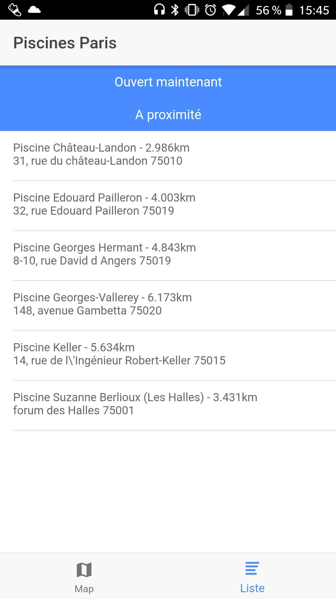
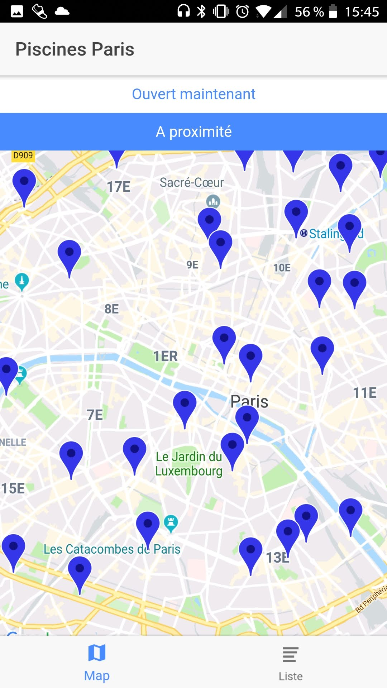

# Piscine Paris app

This app has been created with Ionic and uses the services of the Paris city.

### Requirements

Npm
Ionic

### Installation

``` bash
npm install
```

### Run

##### Web

``` bash
# To run the code in your browser
ionic serve
```

##### Android phone

Follow the instructions on the Android website

### TODO

##### Functional

* Add sorting depending on distance
* Add hours on map when click on a swimming pool
* Add proximity button and update loc (recenter on your current loc)
* Add marker with personal location
* Resolve bug for open now in the map
* Better design for the list
* Change app icon
* Change markers in map

##### Structure 

* Add states (flux architecture)
* Use Promises
* Add better linter (all functions with returned types, ..)
* Add comments

### Screenshots

List with open swimming pools in Paris



Map with swimming pools in Paris



### Troubleshoot

##### Error Missing Translation

Add translatable="false" in the xml file : platforms/android/app/src/main/res/values/strings.xml


